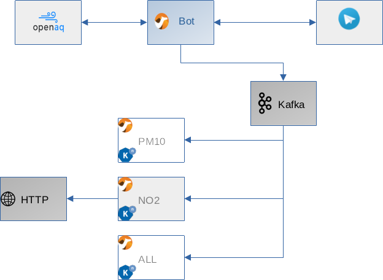

Smart Nazo: Exemplo de Bot para o Telegram
============

Este é um exemplo de bot para o Telegram usando apenas o Camel K e dados disponíveis para
consulta em APIs públicas.

Requirementos
----

Para rodar esse bot você precisa de um ambiente com Kubernetes ou Red Hat OpenShift. É
necessário ter o Apache Kafka rodando no ambiente, para publicação de eventos.

Introdução
----

Esse bot permite consultar dados de poluição do ar publicas pelo projeto sem fins-lucrativos
OpenAQ. Para efeitos da simulação, ele redireciona parte dos dados para uma API de Webhook,
para simular um processo de produção e consumo de eventos.

Arquitetura do Exemplo
----

O bot fornece aos usuários a possibilidade de pesquisar os dados de poluição em 3 países,
sendo possível adicionar mais apenas editando o arquivo `application.properties`.

O bot recebe as mensagens através do Telegram e consulta as requisições no OpenAQ. Dados
novos são cacheados localmente e enviados para o Apache Kafka.

Os dados publicados no Apache Kafka são consumidos por 3 integrações:

- PM10: consome dados de parametros de poluição do tipo PM10 e publica em log
- ALL: consome todos os dados e publica em log
- NO2: consome dados de parametros de poluição do tipo NO2 e envia-os para um "endpoint"
HTTP de simulação.

Deployment (Simples)
----

Para fazer deploy do projeto em um ambiente onde o Kubernetes ou o OpenShift já está instalado,
siga os [passos de instalação](https://camel.apache.org/camel-k/latest/installation/installation.html) disponíveis na página oficial do projeto Camel K.

Se estiver usando um ambiente baseado em Kubernetes:

`make create-project-k8s create-config-map-k8s`

Se estiver usando um ambiente baseado em OpenShift:

`make create-project-oc create-config-map-oc`

Para rodar:

`make run`

Deployment (Avançado)
----

Esse tipo de deployment é voltado para ambientes onde o Kubernetes está instalado, existe
um registro inseguro interno e/ou é necessário utilizar um repositório privado/interno para o
Maven. Exemplos de ambientes com essas caracteristas, são instâncias baseadas em k3s, kind
ou minikube com as configurações básicas de registro, ambientes corporativos com acesso restrito
à repositórios do Apache Maven.

Para fazer deploy do projeto, nesse cenário, rode os seguintes comandos:

`INTERNAL_REGISTRY=endereco-do-registro-interno INTERNAL_MAVEN_REPO=http://endereco-do-repositório-maven make refresh-openjdk setup-advanced && make run`

Para desinstalar, rode:

`make clean`
